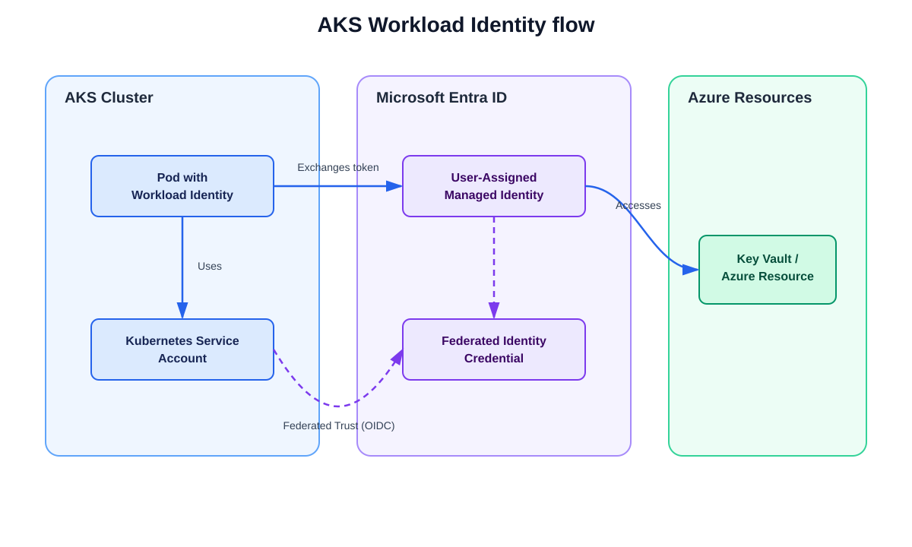

# Terraform AKS Workload Identity

[](https://github.com/JbravoI/terraform-azurerm-aks-workload-identity/actions/workflows/quality.yml)
[](https://github.com/JbravoI/terraform-azurerm-aks-workload-identity/releases)
[](LICENSE)
[](documentation/compatibility.md)

A Terraform reference implementation for a secure Azure Kubernetes Service (AKS) workload-identity pattern. It provisions and configures the Azure identity relationship that lets a Kubernetes workload access Azure Key Vault without storing a long-lived Azure client secret in the application, Kubernetes manifests, or CI/CD secrets.

## Project status

**Release preparation.** The Terraform reference implementation, verification example, quality checks, and operational documentation are in place. A clean Azure example run and repository-owner release configuration remain before the first public release.

## Why use this?

Use this reference implementation when an AKS workload needs to read Azure Key
Vault secrets without a stored Azure client secret. It gives you a deliberately
narrow, reviewable baseline for private AKS networking, Microsoft Entra
Workload Identity, and Key Vault RBAC. The repository includes Terraform,
automated checks, a threat model, operations guidance, and a verification
example that does not print secret plaintext.

It is a reference implementation, not a complete landing zone or multi-tenant
platform. Review the [support boundary and known limitations](documentation/compatibility.md)
before using it.

## What this project demonstrates

- A user-assigned managed identity for an AKS workload.
- A Microsoft Entra federated identity credential bound to one Kubernetes namespace and service account.
- Least-privilege Azure Key Vault data-plane access through Azure RBAC.
- A minimal workload example that authenticates through AKS Workload Identity.
- Terraform validation, linting, security scanning, and tests as delivery quality gates.
- Clear architecture, threat-model, RBAC, deployment, verification, rollback, and cleanup documentation.

## Target flow

```text
Kubernetes workload
  → Kubernetes service account
  → AKS OIDC issuer / projected service-account token
  → Microsoft Entra federated identity credential
  → User-assigned managed identity
  → Azure Key Vault (least-privilege RBAC)
```



The workload obtains short-lived tokens through workload identity. It does not use an Azure client secret to retrieve the Key Vault secret.

## Scope for the first release

The first release intentionally stays narrow:

- One existing AKS cluster integration path.
- One namespace and service account.
- One managed identity and federated credential.
- One Key Vault role assignment at the narrowest practical scope.
- One minimal, reproducible example workload.

Cluster provisioning, multi-tenancy, GitOps, ingress, observability bundles, and general platform onboarding are outside the initial scope. They may be considered only after the secure base path is documented, tested, and released.

## Repository layout

```text
code/                         Root Terraform configuration
code/module/vnet/             Virtual network module
code/module/AKS/              AKS module
code/module/Keyvault/         Key Vault module
documentation/                Architecture, security, operations, ADRs, and release docs
examples/basic-key-vault-access/  Private-cluster workload-identity verification example
.github/workflows/            CI validation and release workflows
```

## Security principles

- No plaintext secrets in Terraform variables, state, plans, manifests, screenshots, logs, or commits.
- Least-privilege Azure RBAC with documented principal, scope, purpose, and review condition.
- Short-lived, federated identity for runtime workloads and CI/CD where supported.
- Separate provisioning and runtime identities.
- A disposable personal Azure subscription for initial verification; never include employer or customer details.

## Quality gates

Pull requests run the following checks:

1. `terraform fmt -check`
2. `terraform init -backend=false`
3. `terraform validate`
4. TFLint and an IaC security scan
5. `terraform test` or equivalent focused tests
6. Terraform plan and policy review before privileged apply

## Documentation

The project documentation covers the architecture and identity flow, threat model, RBAC matrix, operations guide, ADRs, test guidance, and release process. It is maintained under `documentation/` alongside the implementation.

For deployment compatibility, support limits, and the release procedure, see [Compatibility](documentation/compatibility.md) and [Release Process](documentation/release-process.md).

## Prerequisites

- Terraform `>= 1.14.3` and an AzureRM provider version within the supported
  range; see [Compatibility](documentation/compatibility.md).
- An approved, disposable non-production Azure subscription and an existing
  resource group in the intended Azure region.
- Azure CLI authentication with only the permissions approved for the target
  environment. Do not use a client secret for the runtime workload.
- A private-network management host with DNS and network access to the private
  AKS API and Key Vault endpoint for the verification example.
- Approved non-overlapping VNet, AKS subnet, private-endpoint subnet, pod, and
  service CIDRs; plus a Microsoft Entra group object ID for AKS administrators.

## Quick start (non-production)

1. Copy `code/terraform.tfvars.example` to `code/terraform.tfvars` and replace every placeholder with approved non-production values.
2. Review VNet, subnet, pod, service, and connected-network CIDRs with the target network owner.
3. Configure an approved Azure authentication path and run `terraform -chdir=code init`, `validate`, and an approved review plan.
4. Apply only after environment approval; then follow the [workload identity example](examples/basic-key-vault-access/README.md) from a private-network management host.

Do not use the sample identity IDs, Key Vault name, CIDRs, or Kubernetes version unchanged.

## Cost and cleanup

AKS, private endpoints, networking, and supporting Azure resources can incur
charges. Review Azure pricing and your organisation's cost controls before
applying. The example cleanup script removes only its Kubernetes namespace; it
does not remove the AKS cluster, Key Vault, private endpoint, VNet, federated
credential, workload identity, or the verification secret. See the
[example cleanup instructions](examples/basic-key-vault-access/README.md#5-cleanup)
and [incident and rollback runbook](documentation/operations/incident-and-rollback.md).

## Limitations

This first release supports one AKS cluster, one namespace/service-account
trust subject, and one Key Vault secret-read path. It does not provide a
landing zone, multi-tenancy, existing-VNet/Key-Vault integration, central
private DNS ownership, GitOps, dashboards, alerts, or a remote Terraform
backend. Read the full [compatibility and support boundary](documentation/compatibility.md)
before deployment.

## Contributing

See [CONTRIBUTING.md](CONTRIBUTING.md), [CODE_OF_CONDUCT.md](CODE_OF_CONDUCT.md), [SUPPORT.md](SUPPORT.md), [SECURITY.md](SECURITY.md), and the [Release Process](documentation/release-process.md).

## Maintainer

Created and maintained by [@JbravoI](https://github.com/JbravoI). Follow the
project on GitHub for releases and use [Discussions](https://github.com/JbravoI/terraform-azurerm-aks-workload-identity/discussions)
for non-sensitive questions and feedback. See [AUTHORS.md](AUTHORS.md) for
contributor recognition.

## License

This project is licensed under the [Apache License 2.0](LICENSE).
